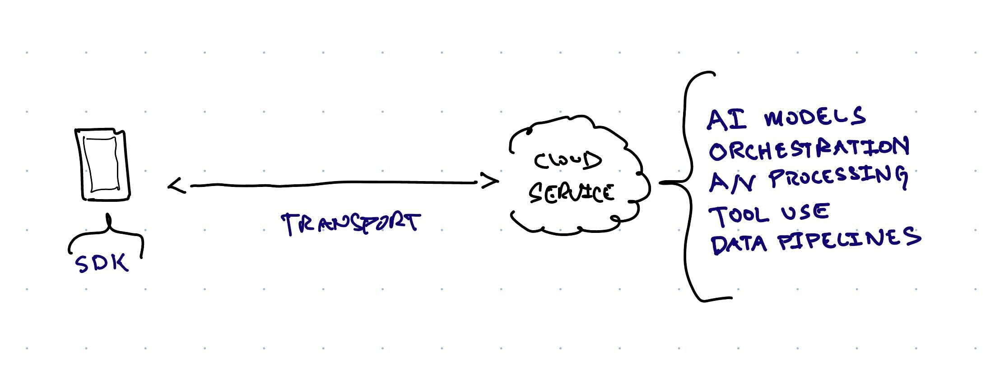
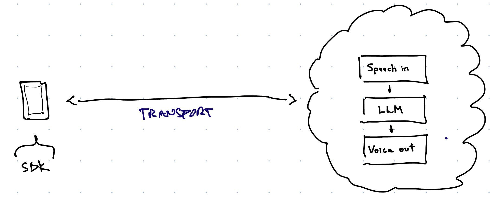
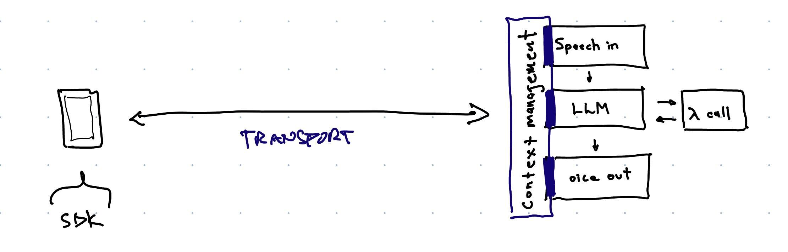
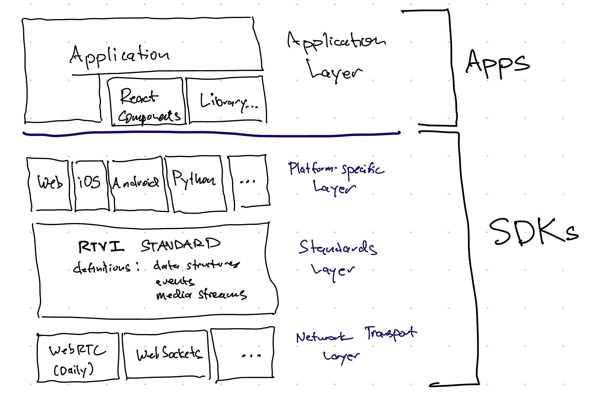
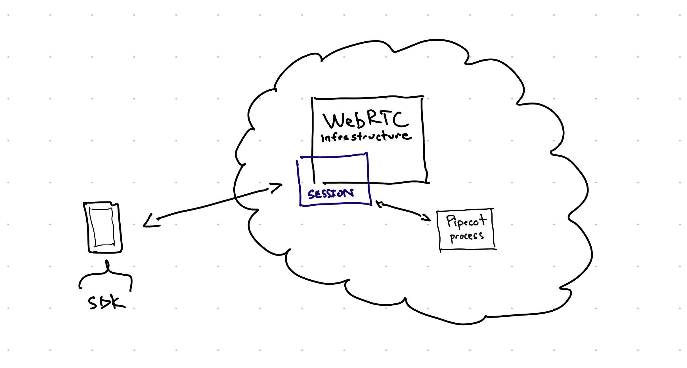

# RTVI-AI: an open standard for Real-Time Voice [and Video] Inference



This GitHub org contains:

  - open source SDK code
  - documentation for standard endpoint shapes, event messages, and data structures

Our goal here is to make it easy to build AI **voice-to-voice** and **real-time video** applications.

  - Applications developers should be able to write code that can use any inference service.
  - Inference services should be able to leverage open source for the complicated, client-side developer tooling needed for real-time multimedia.
  - Any developer should be able to trivially stand up real-time AI infrastructure for small-scale use, testing, or prototyping.

# What client-side code looks like

Here's a voice-to-voice AI "hello world" in Javascript.

```javascript
//
// Start a multi-turn voice-to-voice session in a web app
//

import { VoiceClient } from "@realtime-ai/voice-sdk";

function myTrackHandler(track, participant, voiceClient) {
    if (participant.isLocal || track.kind !== 'audio') {
      return;
    }
    let audioElement = document.createElement('audio');
    audioElement.srcObject = new MediaStream([track]);
    document.body.appendChild(audioElement);
    audioElement.play();
}

const voiceClient = new VoiceClient({
    baseUrl,
    enableMic: true,
    eventHandlers: {
      trackStarted: myTrackHandler,
    }
});

voiceClient.start();
```

The `baseUrl` parameter determines what inference service the client uses. This simple client uses the inference provider's defaults for:

  - which AI model or models are used for audio input, language processing, and audio output
  - system prompt and context management
  - configuration of the workflow "pipeline"
  - what features are automatically enabled
  
To skip straight to geting started with voice-to-voice JavaScript and React development, [go here].

# The real-time AI stack

Conceptually, a voice-to-voice AI application looks like this.



This is a conceptual diagram rather than an architecture diagram. The voice loop in the cloud might use one, three, or many models to perform audio input processing, language-level processing, and audio output. Real-world voice AI applications often use a collection of models, combined with application code that orchestrates how the models are used.

Here's a diagram for a voice AI application that collects information from a patient prior to a healthcare visit. This workflow follows a flexible conversational script and makes function calls out to an external system.



Good standards and SDKs make easy things easy, and hard things possible. A good SDK design is flexible enough to support future capabilities and the evolution of related standards. Finally, we live in a cross-platform world; the Web, iOS, Android, Linux, macOS, and Windows all need first-class support.

Here are the client-side "functional layers" of the RTVI stack.



On the cloud side, implementors have a lot of flexibility. Cloud implementations need to send and receive RTVI events and data structures. But the details of how that happens don't matter to client code!

One way to think about this is that the purpose of a standard like RTVI is to promote interoperability (and lower friction, and increase developer productivity) by specifically constraining client-side implementations but not server-side architectures.

Having said that, reference implementations are helpful. The [Pipecat open source library](https://github.com/pipecat-ai/pipecat) implements RTVI events and data structures.

Here's one way to build RTVI infrastructure using Pipecat or a similar real-time AI library.



# Docs, events and data structures, and extensions

API documentation of RTVI SDKs is in each repo. [iOS], [Android], [JavaScript]

All the standard RTVI events and data structures are in the [standards-docs] repo.

Today, the standard includes the following core building blocks:

  - audio and voice streams
  - text input and output
  - image input and output
  - tts -> llm -> stt pipeline configuration
  - llm context management
  - handling phrase endpointing and interruptions
  - tool use events (function calling)
  - builtin tool extensions
  - WebRTC network transport
  
Here are some code samples showing configuration, extensibility, and
tool use.
  
```javascript
//
// Configure built-in options such as which model to use for LLM
// inference, which voice to use for speech output, and how phrase
// endpointing works.
//

voiceClient = new VoiceClient({
    baseUrl,
    systemPrompt,
    enableMic: true,
    eventHandlers: {
      trackStarted: myTrackHandler,
    },
    config: {
      phrase_endpointing: { vad_timeout: 250 },
      llm: { model: 'llama3-8b-8192' },
      tts: { voice: 'id-145768' }
    }
});
```

```javascript
//
// Vision input via video stream. Enable a builtin "get_camera_frame"
// tool provided by the cloud service. This tool expects the client to
// always send a video stream. When the LLM triggers the "get_camera_frame"
// tool, the cloud provider's implementation will grab the most recent
// video frame as an image and add that image to the LLM inference context.
//
// Expected dialog flow:
//   - user: "What do you see?"
//   - generated voice response: "I see a person, wearing glasses, with
//                                bookshelves in the background."
//

voiceClient = new VoiceClient({
  baseUrl,
  enableMic: true,
  enableCamera: true,
  eventHandlers: {
    trackStarted: myTrackHandler,
  },
  useBuiltinTools: ['get_camera_frame'],
});

```


```javascript
//
// Client-side tool use (function calling). Enable tool use responses
// from the LLM, and handle them locally.
//
// Expected event flow:
//   - user: "What's the weather in San Francisco?"
//   - toolUseResponse event handler called
//   - perform the "get_weather" action locally (call a function,
//     access a database, etc.)
//   - send the response back to the LLM using the
//     voiceClient.sendToolResult() method
//   - generated voice response:
//     "The weather in San Francisco is 64 degrees and foggy."
//

function myToolUseResponseHandler(toolUseResponseJson, voiceClient) {
  let toolUseResponse = JSON.parse(toolUseResponseJson);
  if (!toolUseResponse?.content?.[0]?.type === 'tool_use') {
    console.error("unexpected tool use response", toolUseResponse);
    return;
  }
  let toolInfo = toolUseResponse.content[0];
  // just return a hard-coded string for this example!
  voiceClient.sendToolResult({
    "role": "user",
    "content": [
      {
        "type": "tool_result",
        "tool_use_id": toolInfo.id,
        "content": "64 degrees and foggy"
      }
    ]
  });
}

voiceClient = new VoiceClient({
  baseUrl,
  enableMic: true,
  enableCamera: true,
  eventHandlers: {
    trackStarted: myTrackHandler,
    toolUseResponse: myToolUseResponseHandler,
  },
  "tools": [
    {
      "name": "get_weather",
      "description": "Get the current weather in a given location",
      "input_schema": {
        "type": "object",
        "properties": {
          "location": {
            "type": "string",
            "description": "The city and state, e.g. San Francisco, CA"
          }
        },
        "required": ["location"]
      }
    }
  ],
});

```

# Infrastructure and related technologies

There are three major infrastructure components (non-client code/servers) in an RTVI stack.

1. Network transport
2. Orchestration
3. AI inference

(We are ignoring things like capacity scaling and global distribution. Our purview is only what happens in each individual inference "session.")

## Network transport

Moving audio and video across the Internet at real-time (very low) latencies requires specialized infrastructure. In general, the best approach is to build on top of a standard called [WebRTC](https://webrtcforthecurious.com/). WebRTC is a mature, stable standard and is natively supported in web browsers.

The drawback of using WebRTC is that it is complicated.

WebSockets are a simpler network standard that most developers are familiar with. WebSockets are fine for audio-only, sever-to-server use cases. And you can do quick-and-dirty real-time media prototypes using WebSockets. But for production use, WebSockets introduce too much latency and don't have critical features for media streaming (pacing, bandwidth estimation, buffer management, quality metrics, echo cancellation). There's a reason that WebRTC is so complicated! The media-specific features of WebRTC are necessary for delivering real-time audio and video reliably, at scale.

However, some inference services will want to use WebSockets, either because they are targeting server-to-server use cases or need to interop with older systems. (For example, Twilio telephony).

In addition, there will be future network protocols and standards that make sense to use for real-time AI. (For example, [Media over Quic](https://quic.video/)).

RTVI's approach to flexibility and future-compatibility is to be agnostic about the specifics of a service's transport implementation, but to assume that any transport implementation is approximately as capable as WebRTC.

Here, "capable" is loosely defined as "does what the use case requires." An RTVI service can implement WebSocket transport instead of WebRTC transport without impacting application code. (But that service will likely need to write a large amount of code on top of the basic WebSocket APIs to be production-quality for most use cases.)

## Orchestration

Orchestration means:
  1. state management
  2. performing multiple data processing steps

RTVI's abstraction for orchestration is the **pipeline**. Inference services need to implement at least one pipeline. Some services will offer many pipeline configurations. The RTVI APIs also allow pipelines to be programatically specified from client-side code (if the inference service supports this).

The pipeline abstraction provides surface area for two important client-side capabilities:
  - configuring individual "components" of a service (on-the-fly if the service supports this)
  - changing the processing steps (again, dynamically if the service can support this)

```javascript
//
// Specifying which LLM to use
//

voiceClient.configure({
  llm: { model: 'gpt-4o-mini' }
})
```

```javascript
//
// Customizing the processing "pipeline."
//
// The pipeline is a list of processing steps. A default pipeline
// would typically do:
//
//   STT -> phrase endpointing -> LLM -> TTS.
//
// A default pipeline will also usually manage an LLM messages context
// automatically.
//
// In this hypothetical example, the client-side code overrides the 
// default pipeline to add two additional processing steps, using
// builtin capabilities offered by this cloud service:
//
//   - play a processing sound each time phrase endpointing is triggered
//   - ignore input until a wake word is detected
//

voiceClient = new VoiceClient({
    baseUrl,
    enableMic: true,
    eventHandlers: {
      trackStarted: myTrackHandler,
    },
    pipeline: [
      'wake_words_gate',
      'phrase_endpointing',
      'processing_sound_emitter',
      'llm_context',
      'llm',
      'tts',
      'llm_context'
    ],
    config: {
      wake_words_gate: { trigger_words: ['hey computer', 'ok computer'] },
      processing_sound_emitter: { 'sound': 'ding' }
    }
});
```

Inference services can implement pipelines however makes sense for their infrastructure. The pipeline abstraction is high-level and focused on how the client communicates with the service.

The [Pipecat](https://github.com/pipecat-ai/pipecat) Open Source project provides tools for implementing RTVI-compatible pipelines in Python.

## AI inference

Actually performing inference is out of scope for RTVI!

Having said that, there is lots of potential for both models and inference toolkits to evolve in more and more multi-modal and streaming-native directions. RTVI can provide some help, here, by clearly defining client-side expectations for how streams should be processed and managed.

# Contributing

If you'd like to contribute to RTVI, join the [Pipecat Discord](https://discord.com/invite/pipecat) or submit PRs to the various repos here. We welcome all contributions!
